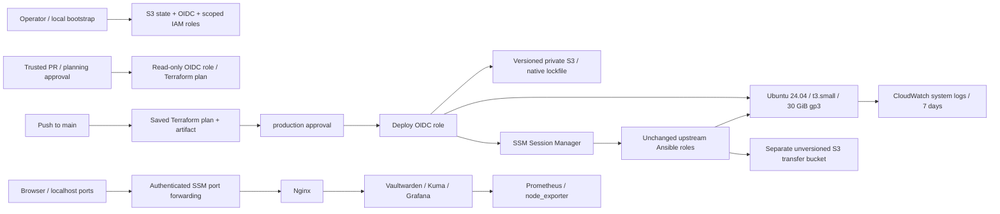

# AWS DevOps Portfolio

[](https://github.com/michaljakubowski2001/aws-devops-portfolio/actions/workflows/apply.yml)

**Code-only phase: AWS activation and local CLI authentication are pending.** No AWS infrastructure has been created, planned, applied or destroyed in this phase. A green check currently means credential-free validation, not a successful AWS deployment. Cloud jobs remain disabled by `AWS_READY=false`.

## Problem

Move a working, resource-constrained DevOps stack from a small VPS to reproducible AWS infrastructure without duplicating configuration code, exposing SSH, or storing permanent AWS credentials in CI.

The application stack is Nginx, Vaultwarden, Uptime Kuma, Prometheus, node_exporter and Grafana. Terraform manages infrastructure; the existing Ansible roles manage applications.

## Architecture



The instance is in one public subnet with an Internet Gateway and an ephemeral public IPv4 address for **outbound** access. Its security group has **no ingress rules**. There is no SSH key pair, port 22 rule, NAT Gateway, Elastic IP, load balancer or paid interface endpoint.

| Terraform root | Responsibility | Lifetime |
| --- | --- | --- |
| `bootstrap/` | State and transfer buckets, GitHub OIDC, plan/deploy roles, EC2 instance role/profile | Retained after lab teardown |
| `infra/` | VPC, subnet, routes, security group, EC2/root disk, CloudWatch log group | Destroy after the exercise |

## Design decisions

- **Reuse without changing Mikrus:** `vendor/mikrus-devops-portfolio` is a Git submodule pinned to commit `115f0443193067ec656594994a3022d5bed197a2`. Ansible resolves `platform` and `stack` directly from that checkout. No role is copied or edited, and this project never runs the Mikrus inventory or bootstrap playbook. Updating the upstream pointer requires an explicit review.
- **Environment differences:** `ansible/inventory/group_vars/portfolio.yml` contains AWS connection settings, localhost URLs and `host_metrics_port: 19100`. Non-secret image digests, memory budgets and monitor definitions are imported from the upstream variables under a namespace. The encrypted Mikrus vault is never loaded. EC2 does not have Mikrus's LXCFS view, so both exporter scrape jobs can read the project exporter; this preserves the unchanged role's four-target assertion.
- **All six services fit the planned budget:** limits total 1,536 MiB (Nginx 64, Vaultwarden 256, Kuma 384, Prometheus 256, node_exporter 64, Grafana 512), leaving approximately 512 MiB for the OS, Docker and CloudWatch agent. The original VPS used roughly 640 MiB for containers at the recorded sample; AWS runtime capacity still needs measurement. No service is omitted. T3 uses **standard** CPU credits to avoid unlimited-credit surcharges; exhausted credits throttle performance.
- **SSM instead of temporary runner-IP rules:** no ingress updates, public SSH or SSH private key. Ansible uses `amazon.aws.aws_ssm`; the runner installs the pinned Session Manager plugin. The instance needs outbound HTTP/HTTPS for package repositories, images, S3 and AWS APIs. The transfer bucket is required by the Ansible connection plugin even for ordinary modules.
- **Private application access:** browser traffic uses SSM port forwarding to `localhost:20157`, `localhost:30157` and `localhost:20158`. The WAN leg is encrypted by SSM; local HTTP is confined to localhost. Browsers treat localhost as a secure context for Vaultwarden. There is no public HTTPS domain or shareable public demo URL in this design. Nginx is reused unchanged, including its proxy-header conventions; application login and URL behavior remain live acceptance checks.
- **Small storage footprint:** Prometheus retains seven days with a 2 GB block-storage limit; logs rotate in Docker. The 30 GiB encrypted gp3 root disk is deleted with the instance. This is an ephemeral lab: termination also deletes application data and generated credentials. Back up anything valuable before replacement or destruction.
- **Pinned toolchain:** Terraform 1.16.4, AWS provider 6.66.0, committed provider lock files, TFLint 0.64.0, AWS ruleset 0.49.0, pinned Ansible collections and Actions commit SHAs. Ubuntu AMIs resolve from Canonical's owner ID at plan time unless `ami_id` is explicitly pinned. The saved plan fixes the selected AMI for that approval. OS packages and the CloudWatch agent follow the vendor repositories rather than immutable package pins.
- **Native state locking:** the S3 backend has `use_lockfile=true`; no DynamoDB table is needed. The state bucket is versioned and protected against accidental destruction. Bootstrap starts with local state and can then be migrated to the same bucket under a separate `bootstrap/` key.

## Security

GitHub authenticates through short-lived OIDC credentials. **No AWS access keys are stored in GitHub Secrets.** Trust checks the exact repository, `sts.amazonaws.com` audience and permitted subject:

| Role | Trusted subject | Permissions |
| --- | --- | --- |
| Plan | `main`, or the approved `planning` environment | Regional discovery, infrastructure-state read and lockfile access |
| Deploy | `production` environment only | Tagged EC2/network resources, project logs, infrastructure-state write, project SSM sessions and transfer objects |
| Instance | EC2 service | SSM agent channels and project log streams |

`production` must require approval and allow only `main`. `planning` requires approval before trusted same-repository PR code can receive read-only AWS credentials. Fork PRs run static checks only. The workflows do not use `pull_request_target`. In this single-maintainer repository, self-review is allowed so the owner can approve a run they initiated; an independent reviewer should replace that setting on a team.

IAM administration remains in bootstrap. The deploy role cannot create/edit IAM roles, change OIDC trust, modify bootstrap state or manage unrelated buckets. `iam:PassRole` is limited to the one EC2 role and service. EC2 mutation is restricted by project tags and region; launches are limited to `t3.small`. Read-only discovery APIs that do not support useful resource scoping use `Resource: "*"`; creation permissions use required project tags. These policies pass static validation but require an actual AWS plan/apply to validate every service authorization path.

Other controls:

- S3 public access blocked, ACLs disabled, AES-256 server-side encryption and HTTPS-only bucket policies.
- Ansible's **separate unversioned transfer bucket** expires abandoned objects after one day; a versioned bucket could retain deleted module arguments containing secrets. Normal completion deletes objects immediately. Both buckets survive infra teardown.
- Passwords are generated once on EC2 into root-owned mode-0600 `credentials.json` on encrypted EBS. They are not in Git, Terraform state, user-data or Actions artifacts. Secret-handling Ansible tasks use `no_log`. Module arguments can transiently pass through the private transfer bucket.
- EC2 requires IMDSv2, has no SSH key and receives a limited instance role. Host networking is inherited from the existing roles; containers do not form a strong boundary against a compromised host or its instance metadata.
- Saved plan artifacts last one day. Plans contain infrastructure metadata and must still be treated as operationally sensitive. Application secrets never enter Terraform.
- GitHub approval authorizes the exact saved plan from the same commit; apply verifies its SHA-256. Concurrent changes are serialized and S3 locks protect state. A stale saved plan fails rather than silently replanning.

## Cost

Planning estimate for **eu-central-1**, Linux On-Demand, before taxes, credits/free-tier allowances, data transfer and variable request/log charges. This is not a billing report.

| Item | Rate assumption | Approximate hourly cost |
| --- | --- | ---: |
| `t3.small` | $0.024/hour, verified in AWS's public regional price feed | $0.0240 |
| One public IPv4 | $0.005/hour, including in-use addresses | $0.0050 |
| 30 GiB gp3 | Budget at $0.0952/GB-month, 730-hour month | $0.0039 |
| S3 and CloudWatch | Depends on stored bytes, requests and log ingestion | Variable |
| **Baseline** | No NAT Gateway, EIP, ALB or paid VPC endpoints | **about $0.033/hour** |

A 24-hour run is approximately **$0.79 plus variable charges**; budget roughly **$0.80–$1.00/day for a quiet lab**, not a spending cap. T3 standard mode avoids surplus CPU-credit charges. Stopping EC2 is not teardown: EBS can continue to cost money. After infra destruction, small S3 storage/request costs can remain because bootstrap is intentionally retained; old state versions accumulate until explicitly removed.

Sources: [AWS regional EC2 price feed](https://b0.p.awsstatic.com/pricing/2.0/meteredUnitMaps/ec2/USD/current/ec2-ondemand-without-sec-sel/EU%20%28Frankfurt%29/Linux/index.json), [AWS public IPv4 pricing](https://aws.amazon.com/vpc/pricing/), [AWS EBS pricing](https://aws.amazon.com/ebs/pricing/), [CloudWatch pricing](https://aws.amazon.com/cloudwatch/pricing/). Recheck rates before deployment.

**This code-only phase created no AWS resources, so its attributable AWS infrastructure cost is $0.** Cost Explorer has not been queried because the account and credentials are unavailable. Existing or unrelated account charges have not been inspected.

## How to run

### 1. Credential-free preparation (completed phase)

```bash
git clone --recurse-submodules https://github.com/michaljakubowski2001/aws-devops-portfolio.git
cd aws-devops-portfolio
# Install Terraform 1.16.4 and TFLint 0.64.0 first.
tflint --init
bash scripts/check-local.sh

python3 -m venv .venv
source .venv/bin/activate
pip install -r ansible/requirements.txt
ANSIBLE_HOME="$PWD/.ansible" ansible-galaxy collection install -r ansible/requirements.yml -p .ansible/collections
ansible-playbook -i ansible/inventory/example.yml ansible/site.yml --syntax-check
```

Do not run the deployment playbook with the example instance ID. `terraform init -backend=false` downloads providers without contacting S3; validation does not prove that IAM permissions, account quotas, AMI availability or services will work at runtime.

### 2. Activate AWS and authenticate locally (pending)

Wait until the account is active. Configure local AWS CLI authentication, preferably with IAM Identity Center/SSO and MFA; do not use root access keys. Confirm the intended account with `aws sts get-caller-identity`. The operator needs the EC2, IAM/OIDC, S3, CloudWatch and SSM rights required by bootstrap and initial review. No credentials should be pasted into Git or chat.

Before **every local apply or destroy**, an automated assistant must show the plan and wait for a fresh explicit `ok`. A prior approval does not authorize subsequent changes. Do not execute commands below while activation is pending.

### 3. Bootstrap locally with a reviewed plan (pending)

```bash
cp bootstrap/terraform.tfvars.example bootstrap/terraform.tfvars
# Set existing_github_oidc_provider_arn if the account already has GitHub OIDC.
terraform -chdir=bootstrap init
bash scripts/local-change.sh bootstrap apply
```

The helper prints a saved plan and requires the operator to type `ok` before applying that exact plan. If an assistant operates it, chat approval is additionally required before proceeding. Keep the initial local state private and backed up until migration:

```bash
terraform -chdir=bootstrap output -raw infra_backend > infra/backend.hcl
cp bootstrap/backend.tf.example bootstrap/backend.tf
# Copy infra/backend.hcl to bootstrap/backend.hcl, then change ONLY the key
# from infra/terraform.tfstate to bootstrap/terraform.tfstate.
terraform -chdir=bootstrap init -migrate-state -backend-config=backend.hcl
```

Review the migration prompt; never use the infrastructure key for bootstrap. This moves state, not infrastructure. The IAM roles used by Actions deliberately cannot access the bootstrap key.

### 4. Configure GitHub protections and enable cloud jobs (pending)

The repository is prepared with `AWS_READY=false`, so pushes run static checks only. Verify these settings before enabling deployment:

1. Settings → Environments → `production`: required reviewer, admin bypass disabled, selected deployment branches restricted to `main`.
2. Environment `planning`: required reviewer for credentialed same-repository PR plans. Fork PRs never receive a role.
3. Publish non-secret bootstrap outputs as repository variables:

```bash
python3 scripts/configure-github.py
# Verify the account, role ARNs, bucket names and environment protections first.
gh variable set AWS_READY --body true
```

Variables are `AWS_REGION`, `AWS_ACCOUNT_ID`, `STATE_BUCKET`, `TRANSFER_BUCKET`, `PLAN_ROLE_ARN`, `DEPLOY_ROLE_ARN` and `INSTANCE_PROFILE_NAME`. AWS credentials are not Secrets or variables. Enable branch protection for `main` with the validation check and review requirements appropriate to your team.

### 5. Deploy and review (pending)

Open a same-repository PR. Static checks run first; approve `planning` to obtain an advisory plan comment. Merge to `main`: CI creates a new saved plan, exposes its summary and artifact, then waits for `production` approval. Inspect replacements and costs before approving.

After apply, CI generates an inventory containing only the Terraform instance ID, waits for SSM/cloud-init, runs the unchanged application roles twice, requires `changed=0` and checks application JSON through SSM tunnels. If configuration fails, infrastructure remains billable; inspect the failure and rerun or use the approved destroy workflow. A failure does not silently delete data.

### 6. Open the applications (pending)

Install AWS CLI and the Session Manager plugin on your workstation. With authorized local credentials, run one command per terminal:

```bash
instance_id=$(terraform -chdir=infra output -raw instance_id)
aws ssm start-session --region eu-central-1 --target "$instance_id" \
  --document-name AWS-StartPortForwardingSession \
  --parameters '{"portNumber":["20157"],"localPortNumber":["20157"]}'
# Repeat using 30157 for Kuma and 20158 for Grafana.
```

Open `http://localhost:20157`, `http://localhost:30157/status/portfolio` and `http://localhost:20158/d/mikrus-infrastructure`. The ports must be free locally. Grafana has anonymous Viewer access inside the tunnel. Grafana and Kuma administrators use username `admin`; retrieve their passwords in a private SSM shell with `sudo cat /opt/devops-portfolio/credentials.json`, without sharing the output. Vaultwarden public signup is disabled. For its blocked admin route, forward directly to service port 18080 instead of Nginx.

## How to destroy

**Complete this before ending a live AWS exercise. Bootstrap remains.** Destroy deletes the root disk, application data and credentials; make an off-host backup first if needed.

Preferred: Actions → **Destroy infrastructure** → select `main` → enter `DESTROY`. CI creates a destroy plan. Review the plan artifact, approve the `production` environment, then wait for the AWS CLI verification step to succeed. The confirmation input alone is not approval.

Local alternative, after showing the plan and receiving a fresh `ok`:

```bash
bash scripts/local-change.sh infra destroy
# The helper applies the approved saved destroy plan, then runs:
AWS_REGION=eu-central-1 python3 scripts/verify-destroy.py
```

The verification script executes read-only AWS CLI queries for tagged non-terminated instances, volumes, VPCs, subnets, security groups, route tables, Internet Gateways, Elastic IPs and project CloudWatch groups. It fails if resources remain. It intentionally excludes bootstrap S3 and IAM. Do not report an empty environment without this live check; it has **not** run during code-only preparation.

After teardown, set `AWS_READY=false` to prevent a later push from scheduling a new deployment. Retained bootstrap has `prevent_destroy` protections and is not targeted by the destroy workflow.

For actual billing after a live session, query Cost Explorer locally (billing data can lag):

```bash
aws ce get-cost-and-usage --region us-east-1 \
  --time-period Start=YYYY-MM-DD,End=YYYY-MM-DD \
  --granularity DAILY --metrics UnblendedCost \
  --group-by Type=DIMENSION,Key=SERVICE
```

Use an exclusive end date. Without an activated cost allocation tag, account totals can include unrelated workloads; compare the session duration with the estimate instead of attributing all account spend to this lab.

## What I learned
