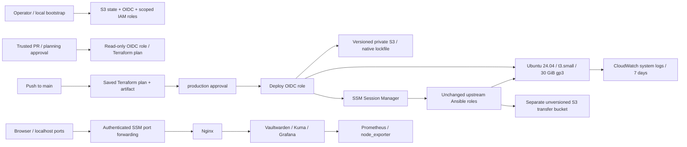
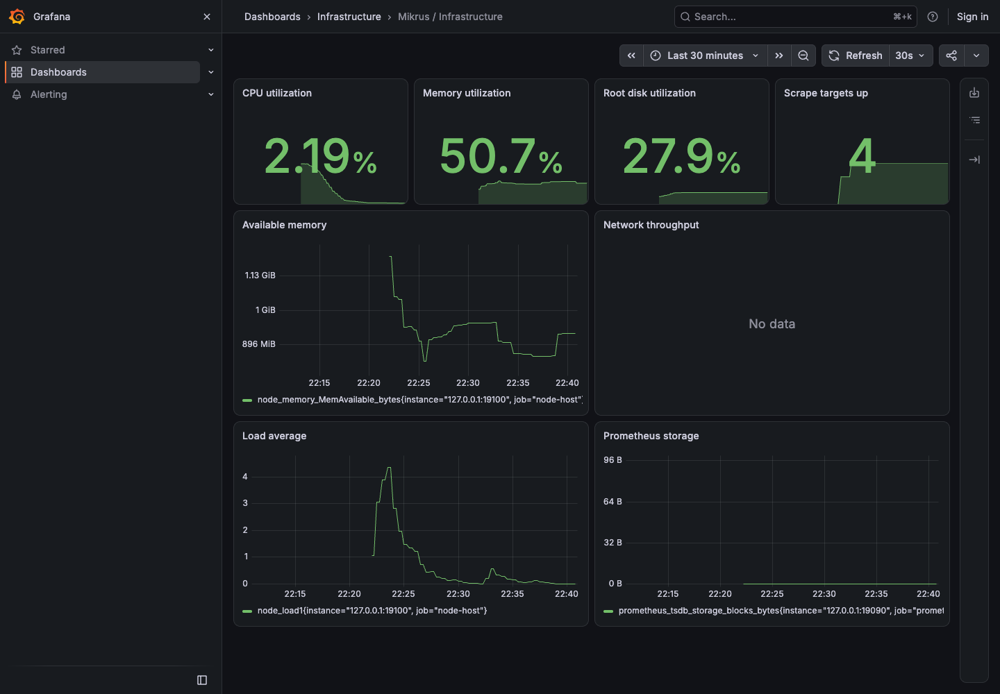
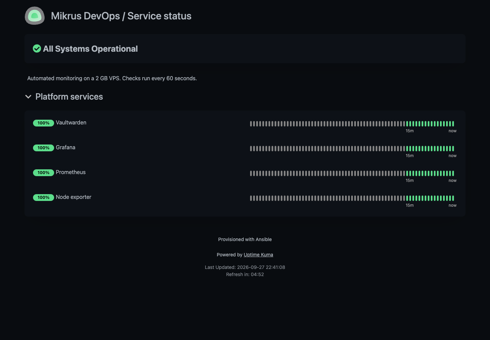

# AWS DevOps Portfolio

A self-hosted monitoring and password-manager stack moved from a 2 GB VPS ([mikrus-devops-portfolio](https://github.com/michaljakubowski2001/mikrus-devops-portfolio)) to AWS. Terraform builds the infrastructure, GitHub Actions deploys it through OIDC and an approval gate, and the **same, unchanged Ansible roles** configure the applications over AWS Systems Manager.

**Status:** deployed end to end by the pipeline from commit [`339130c`](https://github.com/michaljakubowski2001/aws-devops-portfolio/commit/339130c318aae3c2f7f4bb1e9c8c8c7811131937) ([run](https://github.com/michaljakubowski2001/aws-devops-portfolio/actions/runs/36347354637)), verified, then removed with the approved destroy workflow ([run](https://github.com/michaljakubowski2001/aws-devops-portfolio/actions/runs/36348971073)) and confirmed empty with the AWS CLI. The bootstrap layer (state bucket, OIDC, IAM roles) is kept so the environment can be recreated from `main`.

## Highlights

- **No long-lived AWS keys.** GitHub Actions assumes IAM roles through OIDC. Trust is pinned to GitHub's immutable subject (owner and repository IDs), so a renamed or re-created repository cannot assume them.
- **Zero inbound ports.** The security group has no ingress rules: no SSH, no key pair, no bastion. Ansible, smoke tests and browser access all go through SSM Session Manager.
- **Least-privilege IAM, tested.** The deploy role is limited by project tag, region, instance type and one `iam:PassRole` target. `scripts/simulate-deploy-iam.py` checks 63/63 calls in the IAM policy simulator, including 11 negative tests (m5.large, ingress, Elastic IP, NAT, foreign resources, bootstrap state).
- **Approve exactly what runs.** `main` produces a saved Terraform plan. The `production` approval applies that file after checking its commit and SHA-256, with no silent re-plan.
- **Reuse, not copy.** The Ansible roles come from the Mikrus project as a Git submodule pinned to a commit; only inventory variables differ. The second Ansible run must report `changed=0`.
- **About $0.033 per hour** for a t3.small with no NAT Gateway, Elastic IP, load balancer or paid VPC endpoints.

## Problem

Move a working, resource-constrained stack (Nginx, Vaultwarden, Uptime Kuma, Prometheus, node_exporter, Grafana) from a small VPS to reproducible AWS infrastructure. Constraints:

- no duplicated configuration code;
- no SSH exposed to the internet;
- no permanent AWS credentials in CI.

## Architecture

| Terraform root | Responsibility | Lifetime |
| --- | --- | --- |
| `bootstrap/` | State and transfer buckets, GitHub OIDC provider, plan and deploy roles, EC2 instance role and profile | Kept |
| `infra/` | VPC, public subnet, Internet Gateway, route table, security group, EC2 and root disk, CloudWatch log group | Destroyed after each exercise |

The instance sits in one public subnet. Its ephemeral public IPv4 address is used only for **outbound** traffic (packages, container images, AWS APIs). The security group allows egress on 80/443 and has **no ingress rules**.

| Workflow | Trigger | What it does |
| --- | --- | --- |
| `pr.yml` | Pull request | fmt, validate, TFLint, Ansible syntax check. After `planning` approval, posts the plan as a PR comment. |
| `apply.yml` | Push to `main` | Same checks, then a saved plan. After `production` approval: apply, Ansible twice, smoke tests. |
| `destroy.yml` | Manual, input `DESTROY` | Saved destroy plan. After `production` approval: destroy and AWS CLI verification. |

Cloud jobs run only when the repository variable `AWS_READY` is `true`.

## Design decisions

- **Reuse without changing Mikrus.** `vendor/mikrus-devops-portfolio` is a submodule pinned to `e512422`. Ansible loads the `platform` and `stack` roles from it directly. Non-secret upstream variables (image digests, memory limits, monitors) are imported under a namespace. The encrypted Mikrus vault is never loaded.
- **Only the inventory differs.** [`group_vars/portfolio.yml`](ansible/inventory/group_vars/portfolio.yml) sets:
  - the SSM connection;
  - localhost URLs;
  - `host_metrics_port: 19100`. EC2 has no LXCFS, so both exporter scrape jobs read the project's own exporter, which keeps the role's four-target check valid.
- **All six services on t3.small (2 GiB).** Container limits total 1,536 MiB (Nginx 64, Vaultwarden 256, Kuma 384, Prometheus 256, node_exporter 64, Grafana 512), leaving about 512 MiB for the OS, Docker and the CloudWatch agent. Measured memory use was about 50% of the instance (see screenshot). T3 **standard** credits avoid unlimited-mode surcharges.
- **SSM instead of SSH.** The alternative, temporary ingress rules for the runner IP, still opens a port and needs a key. The `amazon.aws.aws_ssm` connection needs only outbound HTTPS and a small S3 transfer bucket, which the plugin requires even for ordinary modules.
- **Private application access.** Browsers reach the apps through SSM port forwarding to `localhost`. That keeps Vaultwarden in a secure browser context without a public domain or certificate. The trade-off is that there is no public demo URL.
- **Credentials generated on the instance.** On the first run, passwords are created on EC2 in a root-only file (mode 0600). They never enter Git, Terraform state, user data or CI artifacts.
- **Pinned toolchain.**
  - Terraform 1.16.4 and AWS provider 6.66.0, with committed lock files;
  - TFLint 0.64.0 with the AWS ruleset 0.49.0;
  - pinned Ansible collections;
  - Actions pinned to commit SHAs.

  The Ubuntu AMI is resolved from Canonical's owner ID at plan time, and the saved plan fixes it for the approval.
- **Native S3 state locking.** `use_lockfile = true` replaces a DynamoDB table. The state bucket is versioned, encrypted and has `prevent_destroy`. Bootstrap state lives in the same bucket under a separate key that the CI roles cannot access.
- **Ephemeral by design.** The environment is short-lived. Destroy deletes the disk, the application data and the generated credentials.

## Security

| Role | Trusted OIDC subject | Permissions |
| --- | --- | --- |
| Plan | `main` branch or the approved `planning` environment | Regional read, infra state read, lockfile |
| Deploy | `production` environment only | Tagged EC2 and network resources, project logs, infra state write, SSM sessions to tagged instances, transfer bucket |
| Instance | EC2 service | SSM agent, project log streams |

- **Trust:** OIDC audience `sts.amazonaws.com` and exact subjects in the immutable form `repo:michaljakubowski2001@189158860/aws-devops-portfolio@1391264686:...`. No `pull_request_target`. Fork PRs never receive credentials.
- **Deploy role boundaries:**
  - it cannot create or edit IAM roles, change OIDC trust or touch bootstrap state;
  - `iam:PassRole` is allowed only for the instance role and only to `ec2.amazonaws.com`;
  - EC2 changes require the `Project` tag and `eu-central-1`;
  - launches are limited to `t3.small` by an explicit deny.
- **Approvals:** `production` requires a reviewer and accepts only `main`. `planning` requires a reviewer before a PR plan gets read-only credentials. Self-review is allowed in this single-maintainer repository; a team would require a second person.
- **Instance:** IMDSv2 required, no SSH key, encrypted gp3 root disk.
- **S3:** public access blocked, ACLs disabled, SSE, HTTPS-only bucket policies.
- **Transfer bucket:** unversioned on purpose (module arguments can contain secrets); objects expire after one day.
- **Artifacts:** saved plan artifacts are kept for one day. Secret-handling Ansible tasks use `no_log`.
- **Known limit:** containers use host networking (inherited from the roles). They are not a strong boundary against a compromised host.

## Troubleshooting log

Real failures from the first deployment and how they were fixed.

**1. OIDC: `Not authorized to perform sts:AssumeRoleWithWebIdentity`**
- *Problem:* the first CI plan could not assume the plan role.
- *Cause:* the repository uses GitHub's **immutable OIDC subject**, so the token carried `repo:michaljakubowski2001@189158860/aws-devops-portfolio@1391264686:ref:refs/heads/main` instead of `repo:owner/repo:...` (found with `gh api repos/OWNER/REPO/actions/oidc/customization/sub`).
- *Fix:* the trust policies match the immutable format through a validated `github_oidc_subject_prefix` variable ([`40c1691`](https://github.com/michaljakubowski2001/aws-devops-portfolio/commit/40c1691625a315a8a17629ef7870642084ea4f7c)). The condition was made more precise, not loosened with a wildcard.

**2. IAM: 403 on `CreateSubnet`, `CreateRouteTable`, `CreateSecurityGroup`**
- *Problem:* apply created the VPC, Internet Gateway and log group, then failed. Terraform recorded the partial state, so nothing was orphaned.
- *Cause:* these actions are authorized against the new resource **and** the parent VPC. The policy required `aws:RequestTag/Project`, which only exists for the resource being created, not for an existing VPC.
- *Fix:* a separate statement allows the three actions on `vpc/*` only when `ec2:ResourceTag/Project` matches ([`e64ef95`](https://github.com/michaljakubowski2001/aws-devops-portfolio/commit/e64ef95)).

**3. Finding 403s one per run**
- *Problem:* each missing permission cost a full pipeline run and left partially created infrastructure.
- *Fix:* [`scripts/simulate-deploy-iam.py`](scripts/simulate-deploy-iam.py) runs every call made by apply, Ansible over SSM and destroy against the live role in the IAM policy simulator. It uses real ARNs and condition keys (request and resource tags, `ec2:CreateAction`, `ec2:InstanceType`, `iam:PassedToService`).
  - The API calls were taken from the plan and from the `aws_ssm` plugin source.
  - Resource types were checked against the AWS Service Authorization Reference.
  - Result: 63/63, including 11 checks that must be denied.
  - The next run ([`339130c`](https://github.com/michaljakubowski2001/aws-devops-portfolio/commit/339130c318aae3c2f7f4bb1e9c8c8c7811131937)) passed end to end in about 14 minutes: plan, apply (7 added), Ansible `changed=8` then `changed=0`, and all smoke tests.

## Screenshots

Captured through SSM port-forwarding tunnels from the live instance with [`scripts/capture-screenshots.py`](scripts/capture-screenshots.py).

**Grafana on AWS** (dashboard provisioned by the reused role). Two panels are empty for reasons inside the unchanged role:
- *Network throughput* queries interface `eth0`, the Mikrus container's name; the EC2 Nitro interface is `ens5`. Fixed upstream in [`3f810bf`](https://github.com/michaljakubowski2001/mikrus-devops-portfolio/commit/3f810bf); the submodule now pins that fix (the screenshot predates it).
- *Prometheus storage* counts only persisted TSDB blocks, and the first block is written after about two hours.

**Uptime Kuma on AWS (roles reused unchanged from the Mikrus project).** The page title and description come from the role variables.

## Cost

Estimate for eu-central-1, Linux On-Demand, before tax and free-tier credits:

| Item | Rate | Per hour |
| --- | --- | ---: |
| `t3.small` | $0.024/h | $0.0240 |
| Public IPv4 (charged while attached) | $0.005/h | $0.0050 |
| 30 GiB gp3 | $0.0952/GB-month over 730 h | $0.0039 |
| S3, CloudWatch, SSM | Requests, bytes stored and ingested | Variable, cents |
| **Total** | No NAT Gateway, Elastic IP, ALB or interface endpoints | **≈ $0.033/h** |

**Actual run (27 September 2026):** the instance ran **32 min 11 s** (launched 20:18:47 UTC by the apply job, terminated 20:50:58 UTC by the destroy job), which is **≈ $0.018**: EC2 $0.013, public IPv4 $0.003 and EBS $0.002. The VPC, Internet Gateway and empty log group left by the failed run between 20:03 and 20:51 are free. S3, CloudWatch and SSM requests add well under a cent. Cost Explorer was not enabled on the account, so this is a rate-card estimate, not a billing figure.

Bootstrap stays and costs a few cents per month (S3 storage and requests). Old state versions accumulate until removed. Stopping the instance is not enough: the disk keeps costing money, so the destroy workflow is the way to end an exercise.

Sources: [EC2 On-Demand pricing](https://aws.amazon.com/ec2/pricing/on-demand/), [public IPv4 pricing](https://aws.amazon.com/vpc/pricing/), [EBS pricing](https://aws.amazon.com/ebs/pricing/), [CloudWatch pricing](https://aws.amazon.com/cloudwatch/pricing/).

## How to run

Full procedure: [docs/runbook.md](docs/runbook.md). In short:

1. `bash scripts/check-local.sh`: fmt, validate and TFLint without AWS credentials.
2. Apply `bootstrap/` locally from a reviewed saved plan, then migrate its state to S3.
3. `python3 scripts/simulate-deploy-iam.py`: check the deploy role before the first run.
4. Set the GitHub variables with `python3 scripts/configure-github.py`, then set `AWS_READY=true`.
5. Push to `main` and approve `production` after reviewing the saved plan.
6. Open Grafana, Kuma and Vaultwarden through SSM port forwarding on `localhost`.

## How to destroy

Actions → **Destroy infrastructure** → branch `main` → type `DESTROY`, then review the saved destroy plan and approve `production`. The job finishes with `scripts/verify-destroy.py`, which uses the AWS CLI to confirm that no tagged instance, volume, VPC, subnet, security group, route table, Internet Gateway, Elastic IP or project log group remains. Then set `AWS_READY=false`. Bootstrap is not touched.

A local alternative and the Cost Explorer query are in the [runbook](docs/runbook.md#7-destroy).

## What I learned

- **Read the real token before changing trust.** My first pipeline run could not log in to AWS. The error only said "not authorized". I asked the GitHub API and saw that my repository sends a different subject: it includes the owner ID and the repository ID. I changed the trust policy to this exact value. A wildcard would also work, but it would trust more than I need. I learned to make a rule more exact, not wider.
- **One API call can check more than one resource.** The next run created the VPC and then failed with 403 on the subnet. Creating a subnet also checks my permission on the VPC it goes into. My policy only checked the tag on the new resource (`aws:RequestTag`). The VPC already existed, so AWS checks its existing tag (`aws:ResourceTag`). I learned to check which resources an action touches in the AWS Service Authorization Reference.
- **Test IAM before the deploy, not with the deploy.** Each missing permission cost me a full pipeline run and left half-built infrastructure. I wrote a script that asks the IAM policy simulator about every call the deploy role makes, and about 11 calls that must be denied. The first result had one failure, but the mistake was in my test, not in the policy. The next pipeline run passed on the first try.
- **Approve the plan that will really run.** The pipeline saves the Terraform plan, and I approve it in the `production` environment. The apply job checks the plan's SHA-256 and applies only that file. When one approved run stopped halfway, Terraform had saved the three new resources in the state. The next run created only the seven missing ones, and nothing was left behind.
- **No open ports is possible, but it has a price.** The server has no inbound rules and no SSH key. Ansible, the tests and my browser all connect through SSM. To see Grafana, I opened a port-forwarding tunnel to `localhost`. The price is no public demo link and an extra S3 bucket for Ansible file transfers.
- **Destroy after every session and check it.** The instance ran for 32 minutes and cost about $0.02. I did not use a NAT Gateway or an Elastic IP, because they cost money even when idle. After the test I ran the destroy workflow and checked with the AWS CLI that nothing was left. One AWS tool still listed the deleted disk for a while, so I checked the disk directly. I also learned that Cost Explorer must be turned on before you need it.
